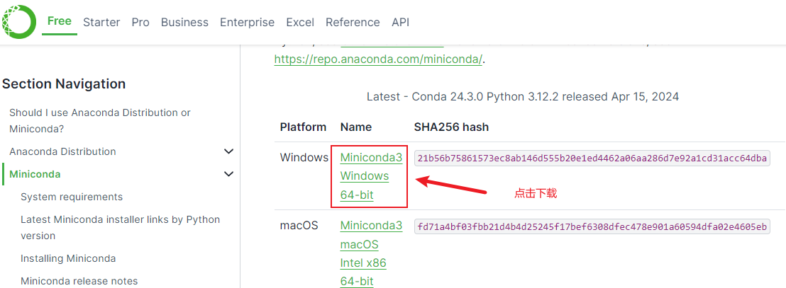

1. 下载odoo源码

   > 官方: [github/odoo](https://github.com/odoo/odoo) 
   >
   > 编译源码: [Source](https://www.odoo.com/zh_CN/page/download), 会缺少odoo-bin文件,需要从github复制, [此网站拉到最下面也可以下载](https://nightly.odoo.com/17.0/nightly/src/)

2. 安装python包管理及虚拟环境软件:  

   > 原始版本,体积较大, 1G :  [anaconda](https://docs.conda.io/projects/conda/en/stable/)
   >
   > 迷你版本, 不到100M : [miniconda](https://docs.anaconda.com/free/miniconda/),  详情见[图片](#conda)

   ```bash
   Set-ExecutionPolicy RemoteSigned  #  选A
   
   conda init powershell  # 初始化    
   
   # 以下命令可能需要在conda prompt中执行
   
   conda create -n odoo310  python=3.10  # 创建安装指定版本命令
   
   conda init  # 初始化
   
   conda active odoo310  # 激活切换到指定版本
   ```

   ##### 如果找不到conda报错, 需要手动设置环境变量, 详细步骤见[图片](#condapath)

3. 单独的3D解析包依赖安装   ???? 存疑  可能不需要安装

   >conda install -c conda-forge pythonocc-core  # from OCC.Core.Bnd import *
   >conda install -c conda-forge trimesh  # import trimesh
   >conda install numpy-stl  # from stl import mesh
   >conda install -c conda-forge cadquery

4. 安装postgreSQL:  [下载地址](https://www.enterprisedb.com/downloads/postgres-postgresql-downloads) 安装步骤里pgAdmin4的勾选不要去掉, 用于数据库可视化管理

5. 打开pgAdmin4软件,  点击 Servers----PostgreSQL 16 ----Login/Group Roles, 右键Create,创建登录角色, 此处填写的user和password需要和odoo的conf文件对应(odoo和Dayu_1688).  General 填写user名称Name, Definition里填密码, Privileges里全部勾选, 点Save保存即可! [详情图片](#pgadmin)

6. 使用pycharm编译器打开源代码目录, 配置运行环境,详情[见图1和2](#1), 切换到指定解释器, 详情[见图3](#3)

   > 1. 找到项目根目录requirements.txt文件, 注释libsass, [见图](#5)
   >
   > 2. 安装odoo运行所需的依赖库
   >
   >    ```bash
   >    pip3 install -r requirements.txt
   >    ```
   >
   > 3. libsass报错解决方案: 到python官方库托管[网站](https://pypi.org/project/libsass/), 手动下载libsass.whl文件[libsass](https://pypi.org/project/libsass/)  然后执行安装命令
   >
   >    ```bash
   >    pip install ./libsass-0.23.0-cp38-abi3-win_amd64.whl
   >    ```
   >
   >     whl文件名不可更改,  安装好后重新执行一次 `pip3 install -r requirements.txt `
   >
   > 4. 配置config, 根目录新建config文件夹,  文件夹下新建odoo.conf
   >
   >    ````bash
   >    [options]
   >    addons_path = E:\xzz\odoo170\odoo\addons
   >    http_port = 8069
   >    db_host = localhost
   >    db_name = odoo
   >    db_password = Dayu_1688
   >    db_port = 5432
   >    db_user = odoo
   >    db_filter = False
   >    ````

7. 运行后浏览器打开localhost:8069, 设置参数,如果直接出现登录界面, 默认用户名和密码都是admin

8. 激活开发者模式,在地址栏web后添加?debug=1, 或者设置,最下面点击`激活开发者模式`


## conda



## condapath


## pgadmin


## 1


## 2


## 3


## 4


## 5


