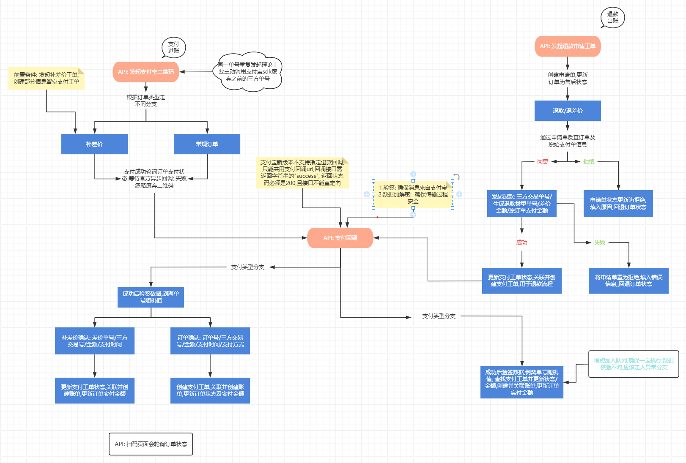

#### 支付宝网页扫码支付对接流程及实现

功能需求: 在自己的网站让用户扫码进行支付/退款

##### 整体流程: [官方文档](https://opendocs.alipay.com/open/05osuz?pathHash=fa169dd3)

    1. 前端发起请求, 传递订单或支付参数给后端
    2. 后端将参数整合, 包含回调url, 调用阿里支付AlipaySdk, 成功响应后会收到返回的二维码字符信息, 交给前端
    3. 前端自行将字符生成二维码, 用户扫码后, 支付宝会请求回调url通知结果
    4. 后端回调接口拿到明文数据,进行校验,变更订单支付状态及其他后续逻辑
    5. 前端轮询单支付状态, 成功则进行后续逻辑!

下图包含完整支付(订单支付/补差价)/退款(全额/部分)


##### 后端请求二维码: [官方文档](https://opendocs.alipay.com/open/8ad49e4a_alipay.trade.precreate)

1. 前置条件

   >1. 支付宝开发平台注册认证, 创建应用,配置密匙,回调域名, [支付能力](https://opendocs.alipay.com/open/00a0ut) 开通订单码功能
   >2. 获取应用 `appid`  `privateKey`  `alipayPublicKey`

2. 获取二维码

   ```ts
    import { AlipaySdk } from 'alipay-sdk';
   const alipay = new AlipaySdk({
           appId: '202155634514138',
           privateKey: 'MIIEv6786678hkiG9w0BAQ',
           alipayPublicKey: 'MIIB678F67856AAOCAQ8AMI',
           gateway: 'https://openapi.alipay.com/gateway.do',
           signType: 'RSA2',  // 可不传  因为阿里回调信息会包含
           encryptKey: 'ZO9hk456dfghdC8mQ==',  // 可不传  如果需要加解密可以用
      }),
   const result = await alipay.exec('alipay.trade.precreate', {
        notifyUrl: 'https://xzz.xzz.com/api/payment/alipay_notify', // 自定义的异步通知回调地址 需要在阿里控制台设置
        bizContent: {
           out_trade_no: 'orderNumber',
           total_amount: '0.01',
           subject: '测试商品',
           store_id: 'NJ_001',
         },
       });
   /*
    {
     code: '10000',
     msg: 'Success',
     outTradeNo: 'order1749458250879',
     qrCode: 'https://qr.alipay.com/bax00213452345m0015',
     traceId: '219078ab1748708922e3521'
   }
   */
   ```

##### 后端发起退款: [官方文档](https://opendocs.alipay.com/solution/624f57f9_alipay.trade.refund?pathHash=d9783f04)
   ```ts
   await alipay.exec('alipay.trade.refund', {
        biz_content: {
          trade_no,  // 阿里平台原支付交易号
          refund_amount: 0.02,  //  退款金额
          refund_reason: '正常退款',
          out_request_no: refundNo,  // 自定义退款单号
        },
      });
   ```


##### 后端接收回调通知(退款及支付都是同一url)
   ```ts
   //  直接传递接口接收到的body数据(内含所有数据及sign和sign_type)
   //  需要注意 验签使用的是阿里公匙 不是应用公匙
   const isValid = this.alipay.checkNotifySignV2(bodyData);
   if (!isValid) throw new error('支付宝回调验签失败');

   ```
